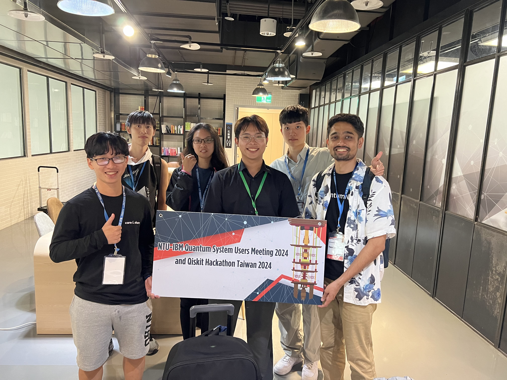

# NTU-IBMQ Hackathon Taiwan 2024 – Group 11

Welcome to our team repository for the NTU-IBMQ Hackathon Taiwan 2024.  
We are **Group 11**, and this repository includes our work, experiments, and photos from the event.

## About Us

We participated in the NTU-IBM Quantum System Users Meeting and Qiskit Hackathon 2024, working on a quantum project over the course of the event.  
It was an exciting and collaborative experience!

## 📸 Hackathon Moments

<table>
  <tr>
    <td></td>
    <td></td>
    <td></td>
  </tr>
</table>

---

## 🔗 Team Info

- Group: 11  
- Project Theme: Analysis, Study and Improvement on MolecularQuantum SimulationProcesses  
- Members: Pawan Sharma Poudel,Shang-Ling,HungLe Duc Truyen,Kui Yo Chen,Yi-Chen Lu

